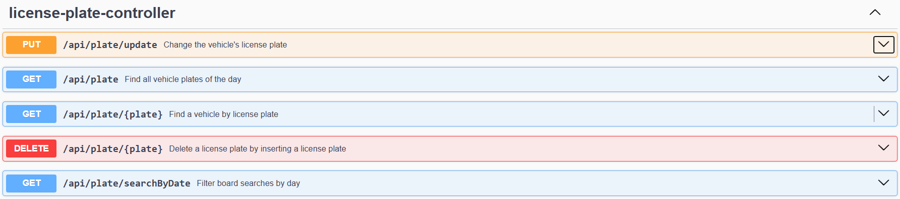
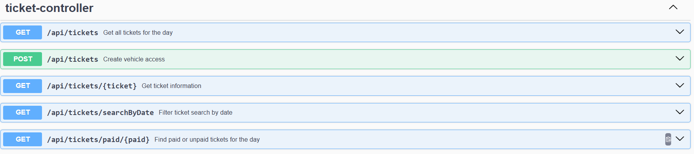
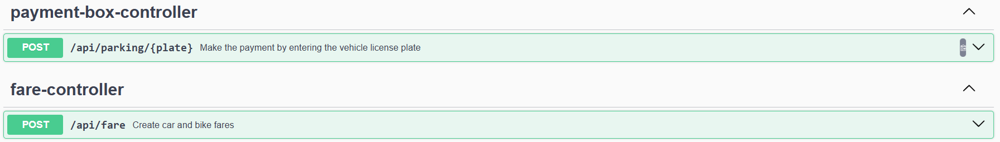

# Easy Parking API

### 🚗 Gerenciamento de Estacionamento com API RESTful

**Easy Parking** é uma API desenvolvida para o gerenciamento de estacionamento. Com ela, é possível definir tarifas para carros e motos, configurar valores de pernoite (incluindo valor e horário), criar acessos para veículos e realizar cobranças de forma simples e eficiente.

### ⚙️ Tecnologias

- **Spring Boot** – Framework Java para criar APIs robustas
- **Java 17** – Linguagem de programação
- **H2 Database** – Banco de dados embutido para testes
- **PostgreSQL** – Banco de dados utilizado para produção
- **Swagger (OAS 3.1)** – Documentação interativa da API

---

## 🚀 Funcionalidades

Com a API **Easy Parking**, você poderá:

- Definir **tarifas diferenciadas** para carros e motos.
- Configurar **valores de pernoite** (incluindo horário e valor específico).
- Criar e gerenciar **acessos para carros e motos**.
- Realizar **cobranças automáticas** com base no tempo de permanência no estacionamento.
- Consultar e manipular informações sobre os **tickets** de estacionamento e **placas de veículos**.

---

## 📜 Endpoints

Aqui estão os principais **endpoints** disponíveis na API:

### **License Plate Controller**



### **Ticket Controller**



### **Payment Box Controller and Create Fare**



---

## 🛠 Como rodar o projeto

### Pré-requisitos

- **Java 17**
- **PostgreSQL** (para ambiente de produção)
- **H2 Database** (para testes)

### Passos

1. Clone o repositório:
   ```bash
   git clone https://github.com/absjuniordev/api-easy-parking.git
   ```

2. Entre na pasta do projeto:
   ```bash
   cd easy-parking-api
   ```

3. Compile e inicie a aplicação com Maven ou Gradle:
   ```bash
   mvn spring-boot:run
   ```

4. A API estará disponível em `http://localhost:8081`.

---

## 📝 Exemplo de Requisição

### Criando um Ticket
**POST** `/api/tickets`

**Request Body**:
```json
{
   "plate": "ABC-1234",
   "vehicleType": "CAR",
   "operatorName": "Julin"
}
```

**Response**:
```json
{
   "id": 1,
   "ticketCode": "202502289",
   "entryTime": "2025-02-28T12:01:16",
   "departureTime": null,
   "amountPaid": null,
   "operatorName": {
      "id": 1,
      "operatorName": "Julin"
   },
   "licensePlate": {
      "plate": "ABC-1234",
      "vehicleType": "CAR"
   },
   "paid": false
}
```

### Consultando Tickets
**GET** `/api/plate/{plate}`

**Response**:
```json
{
  "plate": "ABS-1234",
  "vehicleType": "CAR",
  "tickets": [
     {
        "id": 9,
        "ticketCode": "202502289",
        "entryTime": "2025-02-28T12:01:16",
        "departureTime": null,
        "amountPaid": null,
        "operatorName": {
           "id": 1,
           "operatorName": "Julin"
        },
        "licensePlate": {
           "plate": "ABC-1234",
           "vehicleType": "CAR"
        },
        "paid": false
     }
  ]
}
```

---

## 📚 Documentação Completa

A documentação da API está disponível no Swagger em:

- **[Swagger UI](http://localhost:8081/swagger-ui.html)** – Interface interativa para testar os endpoints.

---

## 🧑‍💻 Contribuindo

Se você deseja contribuir para o **Easy Parking**, siga os seguintes passos:

1. Faça um **fork** deste repositório.
2. Crie uma branch para suas modificações (`git checkout -b feature/novas-funcionalidades`).
3. Realize suas modificações e faça o commit (`git commit -am 'Adicionando novas funcionalidades'`).
4. Envie para o seu repositório (`git push origin feature/novas-funcionalidades`).
5. Abra um **pull request**.

---

## 📧 Contato

- Desenvolvido por: **Arnaldo Junior**
- Email: abs.junnior@hotmail.com
- WhatsApp: https://wa.me/5571993346500?text=

